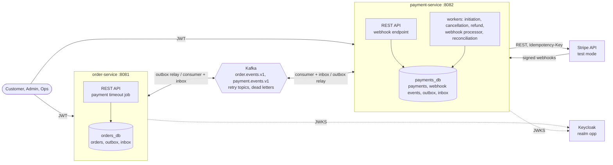

# Order & Payment Integration Platform

[](https://github.com/AlexGorbatov/order-payment-platform/actions/workflows/ci.yml)
[](docs/testing.md)
[](LICENSE)

A reference implementation of an event-driven order and payment integration with **Stripe in test mode only**: two
Spring Boot services (orders, payments) that exchange events over Kafka and keep each other consistent through crashes,
duplicates, late and out-of-order Stripe events, without a distributed transaction. It is written for technical clients
and engineering managers who want to see how a Java integration deals with failure, and for the developer who wants to read
a worked example. It is not a product: correctness under failure, clarity and defensible decisions come before features,
and everything runs locally without a Stripe account.

## What this demonstrates

1. **Effectively-once effects over at-least-once delivery.** Kafka delivers at least once and the services may crash at any
   point; every business effect still happens once, through the outbox, the inbox and state machines that only move
   forward. [Architecture §7](docs/architecture.md#7-reliability-patterns), [ADR-0002](docs/adr/0002-two-services-choreography-saga.md).
2. **Transactional outbox.** An event is written in the same transaction as the change it announces and sent by a polling
   relay with `SKIP LOCKED`; a crash after sending produces a duplicate, never a loss.
   [`OutboxRelay`](libs/platform-messaging-starter/src/main/java/com/altronixsoft/opp/platform/messaging/outbox/OutboxRelay.java),
   [ADR-0004](docs/adr/0004-transactional-outbox-polling-relay.md), `OutboxKafkaOutageIT`.
3. **Inbox (idempotent consumers).** The processed-event record is written in the transaction of the business change, so a
   redelivery is recognised and skipped.
   [`InboxGuard`](libs/platform-messaging-starter/src/main/java/com/altronixsoft/opp/platform/messaging/inbox/InboxGuard.java),
   [ADR-0005](docs/adr/0005-inbox-idempotent-consumers.md), `InboxConsumerIT`.
4. **Idempotency at every boundary.** Client to API (`Idempotency-Key` with request hash), service to Stripe (keys derived from
   local ids), Stripe to webhook (event id), Kafka to consumer (inbox).
   [Architecture §7.3](docs/architecture.md#73-idempotency-layers), [ADR-0006](docs/adr/0006-multi-layer-idempotency.md),
   [`IdempotencyInterceptor`](libs/platform-idempotency-starter/src/main/java/com/altronixsoft/opp/platform/idempotency/IdempotencyInterceptor.java),
   e2e: 20 concurrent creates with one key make one order.
5. **No network call inside a transaction.** Kafka consumers and the webhook endpoint only write state; Stripe is called by
   DB-backed workers that claim work with leases, call outside any transaction and record the result in a new one. A worker killed
   after Stripe answered retries with the same key and gets the same PaymentIntent.
   [ADR-0008](docs/adr/0008-db-backed-work-queues.md),
   [`InitiatePaymentsService`](services/payment-service/src/main/java/com/altronixsoft/opp/payment/application/InitiatePaymentsService.java), e2e `ChaosIT` F05.
6. **Webhook security and ingestion.** Signature verification with rotation (several secrets), tolerance window, body limit,
   live-mode events refused, persist-then-acknowledge, asynchronous processing with backoff and a `DEAD` state.
   [ADR-0009](docs/adr/0009-webhook-ingestion.md),
   [`ReceiveWebhookService`](services/payment-service/src/main/java/com/altronixsoft/opp/payment/application/ReceiveWebhookService.java),
   [`LiveModeGuard`](services/payment-service/src/main/java/com/altronixsoft/opp/payment/adapter/out/stripe/LiveModeGuard.java), `WebhookIT`.
7. **Out-of-order and lost webhooks.** A per-payment watermark plus the state machine drop stale reports; a reconciliation job
   asks Stripe about payments that went quiet and applies the difference through the same state machine.
   [ADR-0010](docs/adr/0010-out-of-order-webhooks-reconciliation.md),
   [`ReconcilePaymentsService`](services/payment-service/src/main/java/com/altronixsoft/opp/payment/application/ReconcilePaymentsService.java), e2e `WebhookResilienceIT`.
8. **Retry topics, dead letters and replay.** Non-blocking retries, a persisted dead-letter store, an operator API to list,
   replay (through the outbox) and resolve, and the ordering trade-off written down.
   [ADR-0007](docs/adr/0007-retry-topics-dlt-ordering-tradeoff.md), [runbook](docs/runbooks/dlq.md), `DeadLetterAdminIT`.
9. **Saga compensation.** A payment that succeeds after the order was cancelled (by the customer or the timeout) is refunded
   automatically; a failed refund is visible and retried by an admin.
   [Architecture §6.4, §6.5](docs/architecture.md#64-cancellation-and-the-late-success-race), e2e `CancellationAndRefundIT`.
10. **Keycloak, roles and ownership.** JWT resource servers validating signature, issuer, audience and expiry; realm roles
    `customer`, `admin`, `ops`; a foreign order is a 404, not a 403. No service-to-service calls, so no service tokens.
    [ADR-0013](docs/adr/0013-keycloak-jwt-no-sync-calls.md), `OrderApiSecurityIT`.
11. **A test strategy that matches the claims.** Unit tests for the state machines, ArchUnit for the layering, Testcontainers
    integration tests per mechanism, and an end-to-end suite that runs both services as real processes with a Stripe
    simulator, `kill -9`, `docker pause` of Kafka and invariants checked after every scenario. No test needs a Stripe account.
    [docs/testing.md](docs/testing.md).
12. **Operability.** One correlation id from the HTTP request through every event, Micrometer metrics for each mechanism,
    runbooks for dead letters and webhooks, a demo with six scenarios. Tracing export, ECS logs and dashboards are *not* part of
    this release ([architecture §13](docs/architecture.md#13-observability)).

## Architecture at a glance



The services never call each other. An order is `PENDING_PAYMENT` until `PaymentSucceeded` arrives; the payment moves through
Stripe's PaymentIntent states, and each service owns its state machine ([§5](docs/architecture.md#5-domain-model)). The flows
are in [§6](docs/architecture.md#6-key-flows), the event contracts in [docs/events.md](docs/events.md).

## Quickstart

Needs Docker with Compose v2, `curl` and `jq`. The first start builds the two service images (a few minutes).

```bash
git clone https://github.com/AlexGorbatov/order-payment-platform.git && cd order-payment-platform
./scripts/up.sh --apps              # PostgreSQL, Kafka, Keycloak, stripe-mock, both services, checkout page
./scripts/demo.sh success           # place an order, pay, watch it become PAID
./scripts/demo.sh --list            # the other scenarios
./scripts/down.sh -v                # stop and delete everything
```

No `.env` is needed locally. Kafka UI is at <http://localhost:8085>, the checkout page at <http://localhost:8090>, Swagger UI at
<http://localhost:8081/swagger-ui.html>. Against real Stripe in test mode: `./scripts/up.sh --apps --stripe-test`
([docs/demo.md](docs/demo.md)).

## Demo scenarios

`./scripts/demo.sh <scenario>` prints a timeline of order and payment statuses and exits non-zero unless the expected final
state is reached. Locally the script sends the webhooks Stripe would send; with `--stripe-test` they come through the Stripe CLI.
[What each scenario demonstrates](docs/demo.md#what-each-scenario-demonstrates).

| Scenario | Story |
|---|---|
| `success` | order, PaymentIntent, card accepted, webhook, order `PAID` |
| `decline-then-success` | a declined card leaves the order open; a second card pays on the same PaymentIntent |
| `3ds` | the card asks for 3-D Secure; the order waits, then it is paid |
| `timeout-late-payment` | nobody pays, the order is cancelled, the money arrives anyway and is refunded automatically |
| `refund` | an admin refunds a paid order: `REFUND_REQUESTED`, `REFUNDED` |
| `dispute` | the cardholder disputes the charge: the order stays `PAID` and is flagged |

## Failure modes

The full matrix has 22 entries ([architecture §15](docs/architecture.md#15-failure-mode-matrix)); each is tested, and
[docs/testing.md](docs/testing.md#where-every-failure-mode-is-tested) maps every one to its tests. A selection:

| ID | Failure | Behaviour | Guarantee | End-to-end test |
|---|---|---|---|---|
| F01 | Kafka down while orders are created | orders commit, the outbox accumulates, the relay retries | delivered after recovery, in order per key | `ChaosIT` (Kafka paused) |
| F05 | crash between Stripe's answer and the local commit | the retry carries the same idempotency key | one PaymentIntent per order | `ChaosIT` (service killed) |
| F09 | duplicate webhook | primary-key conflict, `200` | one state change, one event | `WebhookResilienceIT` |
| F10 | out-of-order webhooks | the stale report is ignored | monotonic state | `WebhookResilienceIT` |
| F11 | webhook lost | reconciliation applies Stripe's state | eventual consistency | `WebhookResilienceIT` |
| F12, F13 | forged or replayed signature; live-mode event | `400`, nothing stored | no forged state, test mode only | `WebhookIT` (service level) |
| F15 | poison Kafka message | retry topics, dead letter, stored, replayable | no consumer blockage | `ChaosIT` |
| F16 | concurrent requests, same `Idempotency-Key` | one executes, the others replay or get `409` | one order | `IdempotencyIT` |
| F18 | payment succeeds after the order was cancelled | automatic refund | customer not charged | `CancellationAndRefundIT` |
| F20 | refund fails | `REFUND_FAILED`, admin retries with a new request | visible and recoverable | `CancellationAndRefundIT` |

## Repository layout

```
libs/event-contracts/                 event envelope, payload records, JSON Schemas
libs/platform-messaging-starter/      outbox, inbox, retry topics, dead-letter store, replay API
libs/platform-idempotency-starter/    HTTP Idempotency-Key support
services/order-service/               orders, catalog, saga participant, payment timeout
services/payment-service/             payments, refunds, Stripe gateway, webhooks, reconciliation
e2e-tests/                            both services as processes: scenarios and chaos tests
demo/checkout/                        demo page: Keycloak login, products, Stripe Payment Element
infra/                                docker-compose, Dockerfile, Keycloak realm, observability skeleton
scripts/                              up/down, tokens, demo scenarios, signed test webhooks
docs/                                 architecture, ADRs, events, runbooks, testing, demo
```

Each service is hexagonal (`domain`, `application`, `adapter.in.*`, `adapter.out.*`, `config`); ArchUnit enforces it.

## Running the tests

Needs JDK 21 and Docker.

```bash
./mvnw verify                                              # unit, architecture, starter and service integration tests
./mvnw -DskipTests -DskipITs -Djacoco.skip=true package    # then the end-to-end scenarios:
./mvnw -pl e2e-tests -am -Pe2e verify
```

`verify` enforces at least 80 % line coverage of `domain` and `application` in both services and checks the formatting
(`./mvnw spotless:apply` fixes it). The end-to-end suite takes about two minutes and is a separate CI job. The pyramid, the
choice of real processes over in-JVM contexts, and the invariants asserted after every scenario are in [docs/testing.md](docs/testing.md).

## Stack

Java 21, Maven (wrapper), Spring Boot 4.0 (Web MVC, Data JPA, Validation, Security OAuth2 Resource Server, Actuator), PostgreSQL 17
with Flyway, Apache Kafka 4 (KRaft) with Spring Kafka, Keycloak 26, `stripe-java` (instance-based `StripeClient`), Resilience4j,
Micrometer, springdoc-openapi, `uuid-creator` (UUIDv7). No Lombok, no MapStruct. Tests: JUnit 5, AssertJ, Awaitility, Testcontainers
(PostgreSQL, Kafka, Keycloak), WireMock, `stripe-mock`, ArchUnit, JaCoCo, Spotless.

## Decisions

Fourteen ADRs, indexed with their status, implementation and tests in [docs/adr](docs/adr/README.md): choreography saga,
hexagonal layout, outbox, inbox, idempotency, retry topics and dead letters, DB-backed work queues, webhook ingestion,
out-of-order handling and reconciliation, JSON events, Stripe test-mode strategy, Keycloak, shared starters.

## Documentation

| | |
|---|---|
| [Architecture](docs/architecture.md) | scope, flows, state machines, reliability patterns, data model, API, failure matrix, known limitations |
| [Events](docs/events.md) | the event catalog and the versioning rules |
| [Testing](docs/testing.md) | pyramid, end-to-end design, scenarios, failure-mode coverage |
| [Demo](docs/demo.md) | the six scenarios, real Stripe test mode, what to look at |
| [Local setup](docs/local-setup.md) | compose profiles, ports, accounts, tokens |
| Runbooks | [dead letters](docs/runbooks/dlq.md), [webhooks](docs/runbooks/webhooks.md) |
| [Backlog](docs/backlog.md), [Changelog](CHANGELOG.md) | what is deliberately not done, what changed |

## Limitations

Test mode only, by design (the application refuses to start with a live key). Partial refunds, multi-currency, manual
capture and a production deployment (Kubernetes) are out of scope. Tracing export, structured logs and dashboards are not
included; the metrics and correlation ids are. The list with reasons: [architecture §17](docs/architecture.md#17-out-of-scope--future-work).

## License

[MIT](LICENSE)
