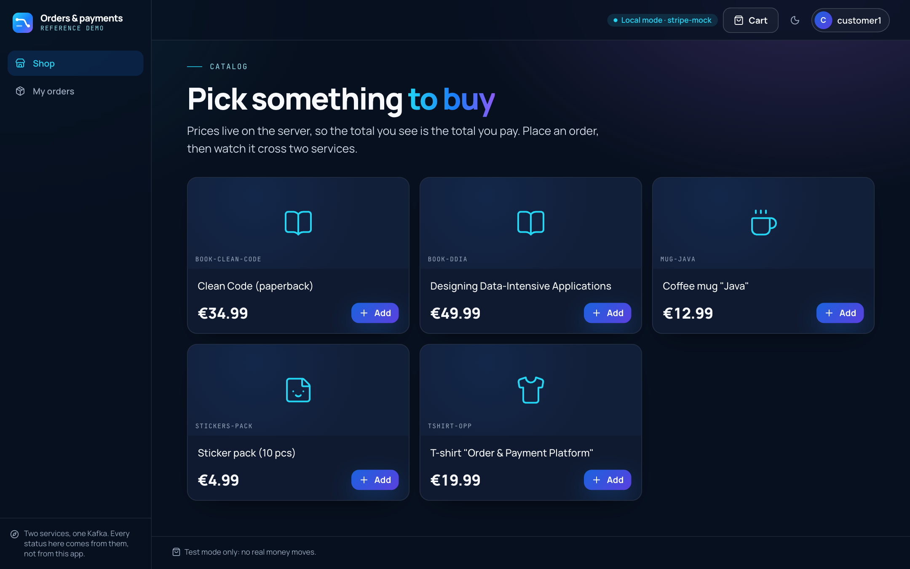
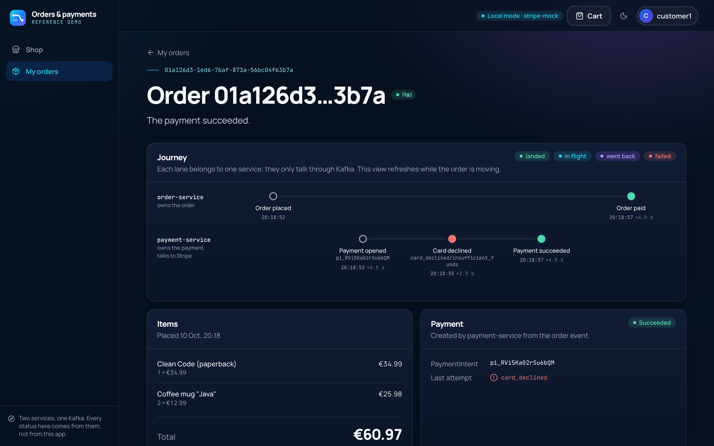
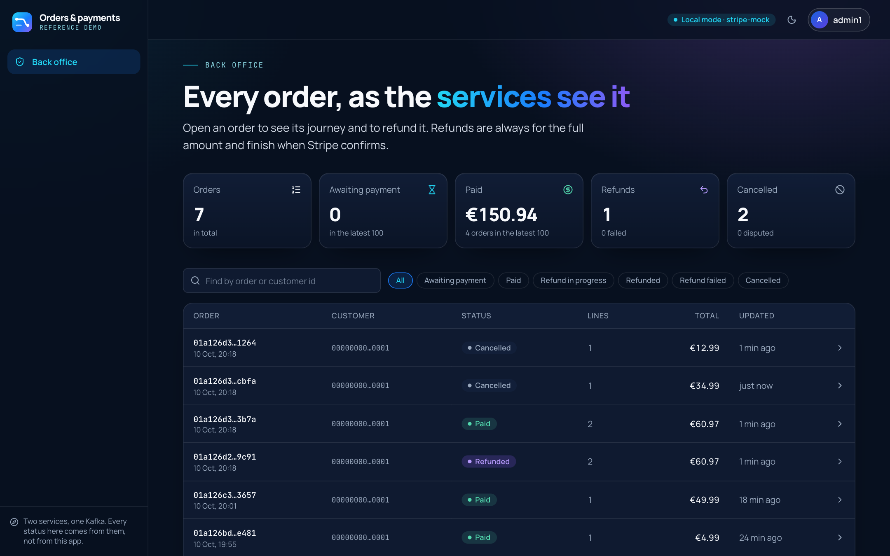
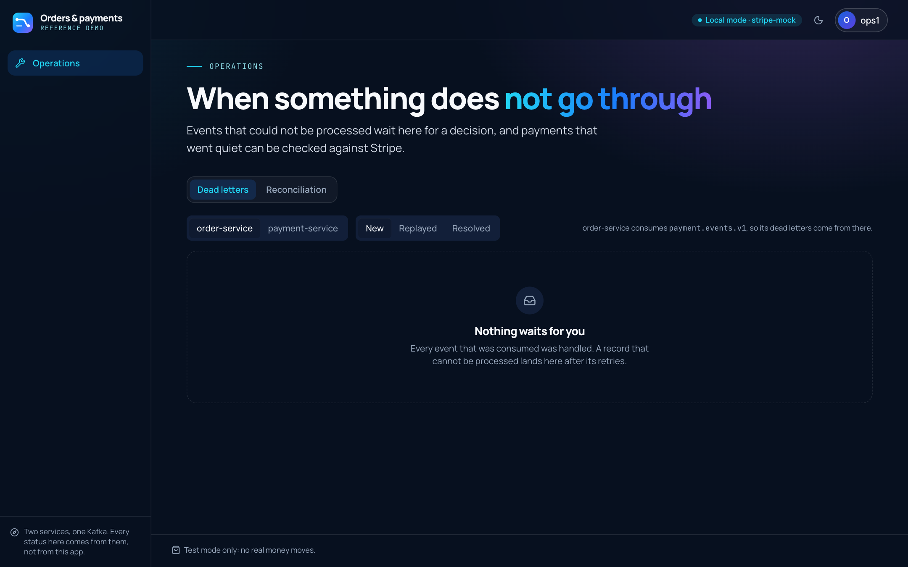
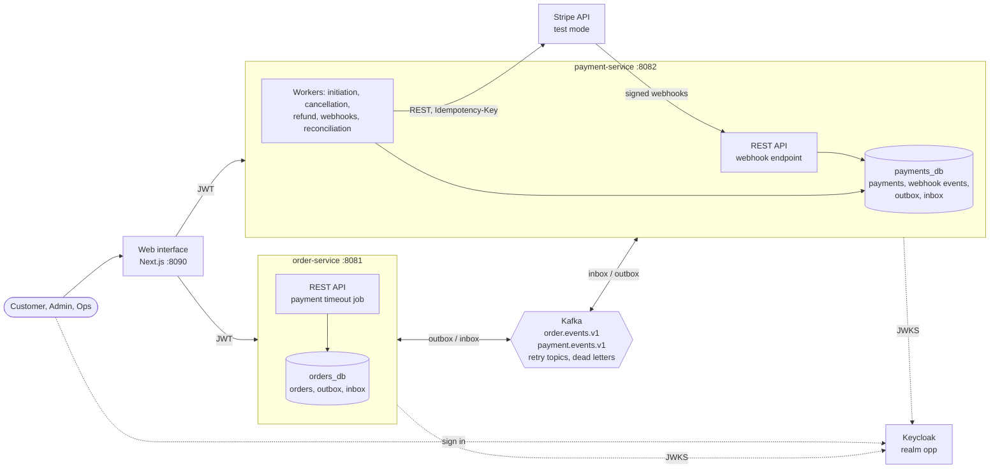

# Order & Payment Integration Platform

[](https://github.com/AlexGorbatov/order-payment-platform/actions/workflows/ci.yml)
[](LICENSE)

A demo of an order and payment flow built from two Spring Boot services that talk through Kafka, with **Stripe in test mode
only**. Place an order, pay it with a test card, cancel it, refund it, and watch each step cross both services. It runs on your
machine without a Stripe account; real Stripe test mode is optional.

## What it does

- **Shop and orders:** a catalog, a cart, orders with a status history, cancellation.
- **Payments with Stripe:** PaymentIntents, 3-D Secure, declines and retries, full refunds, disputes.
- **Back office and operations:** every order with filters and refunds for admins; dead letters and reconciliation for ops.
- **Built to survive failures:** duplicate requests, repeated or out-of-order webhooks, a crash or Kafka outage in the middle of
  a payment do not charge or refund twice ([architecture](docs/architecture.md)).

## Screenshots

| | |
|---|---|
| <br>**Shop**: the catalog and cart | <br>**Order page**: the journey across both services |
| <br>**Back office**: every order, filters, refunds | <br>**Operations**: dead letters and reconciliation |

## Architecture



The services never call each other: an order stays `PENDING_PAYMENT` until a `PaymentSucceeded` event arrives from Kafka. Stripe
is called only by background workers, never inside a database transaction. More in [docs/architecture.md](docs/architecture.md).

## Quickstart

Needs Git, Docker with Compose v2, Bash, `curl`, `jq` and `openssl`. The first start builds the images (a few minutes).

```bash
git clone https://github.com/AlexGorbatov/order-payment-platform.git && cd order-payment-platform
./scripts/up.sh --apps              # PostgreSQL, Kafka, Keycloak, stripe-mock, both services, web interface
./scripts/demo.sh success           # place an order, pay, watch it become PAID
./scripts/down.sh                   # stop; keep local data
```

Open the web interface at <http://localhost:8090> and sign in as `customer1`, `admin1` or `ops1` (password `password`).
No configuration is needed. For real Stripe test mode and everything else about running it, see the [demo guide](docs/demo.md).

## Demo scenarios

`./scripts/demo.sh <scenario>` prints a timeline of order and payment statuses.

| Scenario | Story |
|---|---|
| `success` | order, PaymentIntent, card accepted, webhook, order `PAID` |
| `decline-then-success` | a declined card leaves the order open; a second card pays |
| `3ds` | the card asks for 3-D Secure; the order waits, then it is paid |
| `timeout-late-payment` | nobody pays, the order is cancelled, the money arrives anyway and is refunded automatically |
| `refund` | an admin refunds a paid order |
| `dispute` | the cardholder disputes the charge: the order stays `PAID` and is flagged |

## Layout

```
services/order-service/               orders, catalog, saga participant
services/payment-service/             payments, refunds, Stripe gateway, webhooks, reconciliation
libs/                                 event contracts, outbox/inbox starter, idempotency starter
web/                                  web interface (Next.js)
e2e-tests/                            both services as processes: scenarios and chaos tests
infra/  scripts/                      docker-compose, Keycloak realm, demo and token scripts
docs/                                 architecture, event catalog, demo guide
```

## Tests

Needs JDK 21 and Docker.

```bash
./mvnw verify                                              # unit, architecture and integration tests
./mvnw -DskipTests -DskipITs -Djacoco.skip=true package    # then the end-to-end scenarios:
./mvnw -pl e2e-tests -am -Pe2e verify
```

No test needs a Stripe account. The web interface has its own checks: `npm run lint`, `npm test` and `npm run build` in `web/`.

## Stack

- **Backend:** Java 21, Spring Boot (Web MVC, Data JPA, Security OAuth2 Resource Server, Actuator), PostgreSQL with Flyway,
  Apache Kafka (KRaft) with Spring Kafka, Keycloak (OIDC, JWT, PKCE), `stripe-java`, Resilience4j, Micrometer, springdoc-openapi.
- **Patterns:** hexagonal architecture, choreography saga, transactional outbox and inbox, idempotency at every boundary,
  database-backed workers, reconciliation with Stripe.
- **Web interface:** Next.js 16, React 19, TypeScript, Tailwind CSS 4, Radix UI, TanStack Query, Stripe Elements.
- **Tests:** JUnit 5, AssertJ, Awaitility, Testcontainers, WireMock, `stripe-mock`, ArchUnit, JaCoCo; Vitest for the web interface.
- **Infrastructure:** Docker Compose, Stripe CLI, Kafka UI, GitHub Actions; OpenTelemetry Collector, Jaeger, Prometheus and
  Grafana as empty skeletons.

## Documentation

- [Demo guide](docs/demo.md): running it, accounts, scenarios, real Stripe test mode.
- [Architecture](docs/architecture.md): flows, state machines, reliability patterns, failure modes, decisions.
- [Event catalog](docs/events.md): the events the services exchange.

## License

[MIT](LICENSE)
