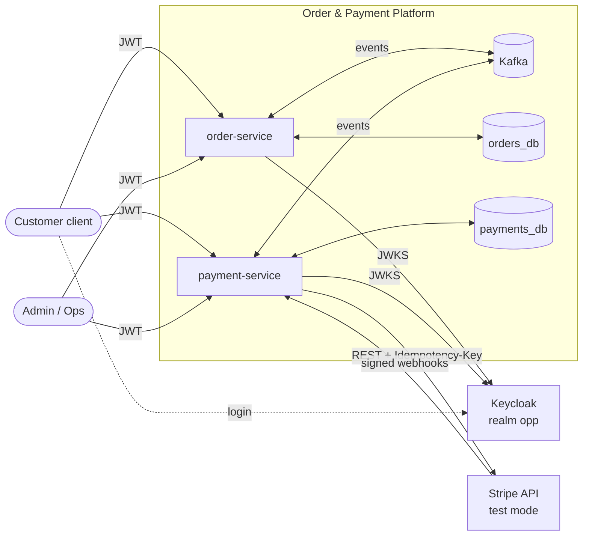
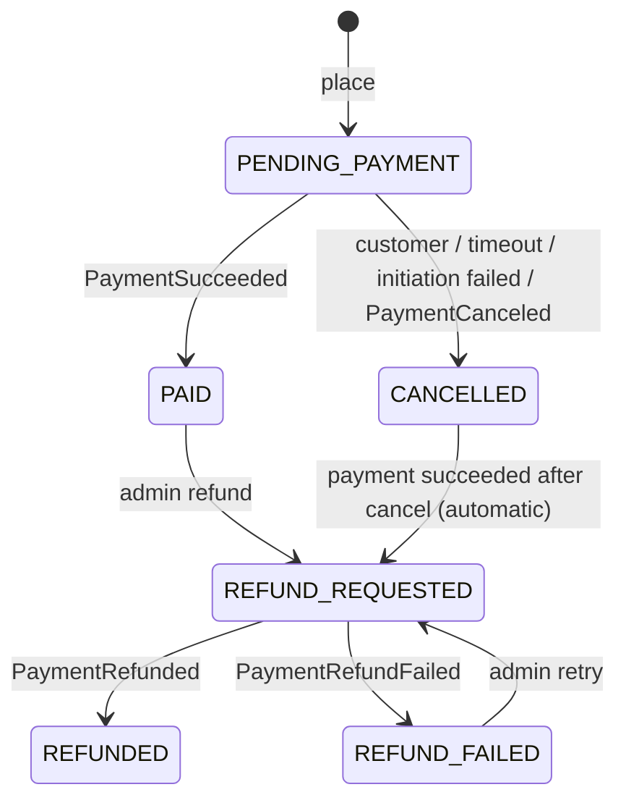
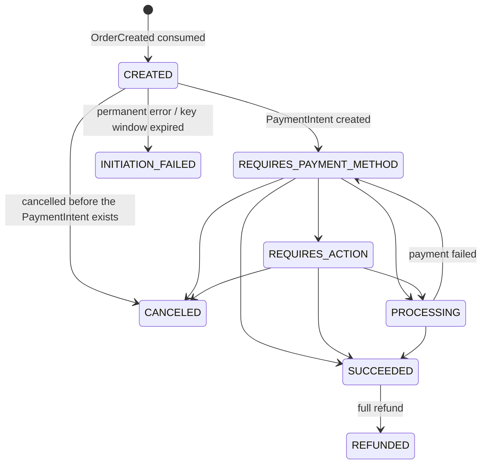
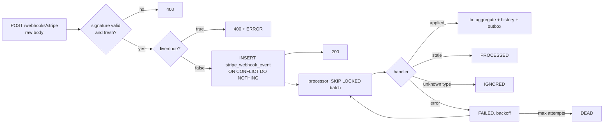

# Architecture

How the platform is put together: two services, Kafka between them, Stripe (test mode) on the edge. Section numbers are stable
because the code refers to them.

## 1. Purpose and scope

A reference implementation of a reliable order → payment integration: event-driven saga, effectively-once business effects over
at-least-once delivery, secure webhook ingestion, and tests that need no Stripe account.

In scope: two services that talk only through Kafka; Stripe PaymentIntents (create, cancel, full refund, dispute notification);
signed webhooks; outbox, inbox, HTTP idempotency, retry topics and dead letters; reconciliation with Stripe; Keycloak roles.
Out of scope: partial refunds, multi-currency, inventory and shipping, Avro/Schema Registry, CDC, Kubernetes.

## 2. Quality goals

1. No double charge and no lost payment.
2. No lost events.
3. Effectively-once effects.
4. Security: signed webhooks, JWT with roles and ownership, test-mode guard, no secrets in the system.
5. Every failure in §15 has an automated test that needs no real Stripe.

## 3. System context



The services never call each other. Locally, webhooks reach `payment-service` through the Stripe CLI (real test mode) or the
test signer script (`stripe-mock`).

## 4. Structure

```
libs/event-contracts                 event envelope, payload records, JSON Schemas
libs/platform-messaging-starter      outbox, relay, inbox, retry topics, dead letters
libs/platform-idempotency-starter    @Idempotent HTTP support
services/order-service               port 8081, orders_db
services/payment-service             port 8082, payments_db
e2e-tests                            both services as processes: scenarios and chaos tests
web/                                 Next.js interface
infra/  scripts/                     compose, Keycloak realm, demo and token scripts
```

Each service is hexagonal: `domain`, `application`, `adapter.in.{web,kafka,webhook,job}`, `adapter.out.{persistence,stripe,messaging,metrics}`,
`config`. ArchUnit enforces the layering.

## 5. Domain model

### 5.1 Order



A failed attempt or a 3-D Secure step does not change the order: the customer can retry on the same PaymentIntent until the
timeout. A dispute only sets `disputed`. Prices come from the server-side catalog; the client sends SKUs and quantities.
Every transition is written to `order_status_history`.

### 5.2 Payment



What Stripe reports goes through one state machine that returns `APPLIED`, `UNCHANGED` or `STALE_IGNORED`; reports older than the
payment's last Stripe timestamp, or not an allowed transition, are ignored.

### 5.3 Refund

`REQUESTED` → `PENDING` (Stripe refund created) → `SUCCEEDED` or `FAILED`. Full refunds only; one refund per `refundRequestId`,
and at most one open refund per payment.

## 6. Key flows

### 6.1 Happy path

```mermaid
sequenceDiagram
  autonumber
  actor C as Customer
  participant OS as order-service
  participant K as Kafka
  participant PS as payment-service
  participant S as Stripe (test)
  C->>OS: POST /api/v1/orders (JWT, Idempotency-Key)
  OS->>OS: tx: order PENDING_PAYMENT + outbox OrderCreated
  OS-->>C: 201
  OS->>K: relay OrderCreated
  K->>PS: OrderCreated
  PS->>PS: tx: inbox + payment CREATED
  PS->>S: worker: create PaymentIntent (key pi-create:{paymentId})
  PS->>PS: tx: REQUIRES_PAYMENT_METHOD + outbox PaymentInitiated
  C->>PS: GET /api/v1/payments/by-order/{id}
  PS-->>C: status + clientSecret (no-store)
  C->>S: confirm
  S->>PS: webhook payment_intent.succeeded (signed)
  PS->>PS: verify, store, 200; processor: SUCCEEDED + outbox PaymentSucceeded
  PS->>K: relay PaymentSucceeded
  K->>OS: PaymentSucceeded
  OS->>OS: tx: inbox + order PAID
```

### 6.2 Failed attempt and retry

`payment_intent.payment_failed` stores the error and publishes `PaymentAttemptFailed`; the order stays `PENDING_PAYMENT` and the
customer confirms again on the same PaymentIntent.

### 6.3 Strong customer authentication (3-D Secure)

`requires_action` publishes `PaymentActionRequired`; the order does not change until `succeeded` or `payment_failed` arrives.

### 6.4 Cancellation and the late-success race

```mermaid
sequenceDiagram
  autonumber
  participant OS as order-service
  participant K as Kafka
  participant PS as payment-service
  participant S as Stripe
  OS->>OS: timeout or customer: CANCELLED + outbox OrderCancelled
  OS->>K: OrderCancelled
  K->>PS: cancel_requested = true
  PS->>S: worker: cancel PaymentIntent (key pi-cancel:{paymentId})
  alt cancelable
    S-->>PS: canceled; webhook payment_intent.canceled
  else already succeeded (race)
    S-->>PS: 400 unexpected state (no retry)
    S->>PS: webhook payment_intent.succeeded
    K->>OS: PaymentSucceeded on a CANCELLED order
    OS->>OS: REFUND_REQUESTED (LATE_PAYMENT_AFTER_CANCEL)
  end
```

A payment that has no PaymentIntent yet is cancelled locally without calling Stripe. The payment timeout is a job in
order-service (30 minutes by default; shorter in the demo).

### 6.5 Refund

An admin (or the automatic compensation above) requests a refund; payment-service creates a `Refund`, a worker calls Stripe
(key `refund:{refundId}`), and the final state comes from the webhook: `PaymentRefunded` → order `REFUNDED`, or
`PaymentRefundFailed` → order `REFUND_FAILED`, which an admin can retry with a new request.

### 6.6 Webhook pipeline



### 6.7 Order-side handling of payment events

order-service consumes `payment.events.v1` once per `eventId`. Each rule checks the order's status first: a duplicate or a race
is a no-op, anything the state cannot explain goes straight to the dead-letter topic. `PaymentSucceeded` marks a pending order
`PAID` and, on a cancelled order, requests the automatic refund; `PaymentInitiationFailed` and `PaymentCanceled` cancel a
pending order; `PaymentRefunded` and `PaymentRefundFailed` complete the refund request they belong to; `PaymentDisputed` sets the
flag.

## 7. Reliability patterns

### 7.1 Transactional outbox
The business change and its `outbox_event` row share one transaction. A polling relay (`FOR UPDATE SKIP LOCKED`) sends to Kafka
with `acks=all` and an idempotent producer and marks the row published. A crash after sending can publish twice; the inbox
absorbs that. Published rows are deleted after 7 days.

### 7.2 Inbox (idempotent consumer)
`INSERT INTO inbox_message(consumer_group, event_id) ON CONFLICT DO NOTHING` in the same transaction as the business change; no
row inserted means a duplicate. Inbox rows are kept 14 days, so aggregate constraints still guard older replays.

### 7.3 Idempotency layers

| Boundary | Mechanism | Window |
|---|---|---|
| Client → API | `Idempotency-Key` + request hash | 24 h |
| Service → Stripe | Stripe key `pi-create:{paymentId}`, `pi-cancel:{paymentId}`, `refund:{refundId}` | Stripe's retention (at least 24 h) |
| Stripe → webhook | event id as primary key | until purged |
| Kafka → consumer | inbox on (group, eventId) | 14 days |
| Business | state machine + optimistic locking | — |

A completed key with the same request replays the stored response (`Idempotent-Replayed: true`); the same key with another body is
a 422; a request still running is a 409. The business transaction and the stored response are separate commits, so a crash
between them can let a retry create a second order; closing that window is future work.

### 7.4 Retries and dead letters
Consumers retry briefly in place, then through non-blocking retry topics (1 s, 10 s, 60 s), then to `<topic>-dlt`. Malformed or
unexplainable messages go straight to the dead-letter topic. A listener stores every dead letter; an operator can list, replay
(through the outbox) or resolve it (`/admin/dead-letters`, role `ops`). Retry topics break per-key ordering; the consumers
tolerate that.

### 7.5 Ordering
The partition key is the order id on both topics, so one order's events stay in order within a topic. Nothing relies on ordering
across topics or on the order of Stripe webhooks (§8.3).

### 7.6 DB-backed work queues for external calls
Kafka consumers and the webhook endpoint only write state. Scheduled workers claim due rows (`next_attempt_at`) with `SKIP
LOCKED` and a lease, call Stripe outside any transaction, and record the result in a new one. Transient errors back off with
jitter; permanent ones end in a terminal state and an event. The only network call inside a transaction is the outbox relay's
Kafka send.

## 8. Stripe integration

### 8.1 Modes

| Mode | Stripe API | Webhooks | Account |
|---|---|---|---|
| tests | WireMock and `stripe-mock` | signed in the test | none |
| `local` | `stripe-mock` | `scripts/send-test-webhook.sh` | none |
| `stripe-test` | real Stripe, `sk_test_` key | Stripe CLI `listen` | free test account |

### 8.2 Gateway
`PaymentGateway` is the port; the adapter uses an instance `StripeClient` with timeouts, a circuit breaker and error
classification (transient, permanent, configuration). A payment still in `CREATED` after 23 hours becomes `INITIATION_FAILED`
instead of retrying with a possibly expired key. `LiveModeGuard` refuses to start with a non-test key.

### 8.3 Webhooks
The raw body is verified with the `Stripe-Signature` header (HMAC-SHA256, 300 s tolerance, several secrets for rotation, body
limit 256 KB); `livemode=true` is rejected. The event is stored, acknowledged, and processed asynchronously. A payment applies an
event only if it is newer than the last one it applied and the transition is allowed. Handled: `payment_intent.*` (processing,
requires_action, payment_failed, succeeded, canceled), `charge.refunded`, `refund.failed`, `charge.dispute.created`; other types
are ignored.

### 8.4 Reconciliation
Every 5 minutes, payments that are not final and have been quiet for 10 minutes are retrieved from Stripe and passed through the
same state machine, which covers lost webhooks. It does not cover pending refunds or disputes. Manual run:
`POST /admin/reconciliation/run` (role `ops`).

### 8.5 Test payment methods
`pm_card_visa` (success), `pm_card_chargeDeclined`, `pm_card_chargeDeclinedInsufficientFunds`, `pm_card_authenticationRequired`
(3-D Secure), `pm_card_createDispute`, `pm_card_refundFail`.

## 9. Messaging contracts

### 9.1 Topics

| Topic | Producer | Consumer group | Key |
|---|---|---|---|
| `order.events.v1` | order-service | `payment-service` | orderId |
| `payment.events.v1` | payment-service | `order-service` | orderId |
| `<topic>-retry-*`, `<topic>-dlt` | Spring Kafka | source group / dead-letter persister | orderId |

### 9.2 Envelope
Every event is JSON with `eventId` (UUIDv7), `eventType`, `eventVersion`, `aggregateType`, `aggregateId`, `partitionKey`,
`occurredAt`, `producer`, `correlationId`, `causationId` and `payload`. Additive changes keep the version; breaking changes add
a new one. Schemas: `libs/event-contracts`.

### 9.3 Events
The catalog, with payloads and examples, is in [events.md](events.md). Unknown event types and versions are skipped, not
dead-lettered.

## 10. Data model

Each service has its own database. The starters add `outbox_event`, `inbox_message` and `dead_letter_message` to both, and
`idempotency_record` where `@Idempotent` is used.

- **orders_db:** `product`, `orders`, `order_item`, `order_status_history`.
- **payments_db:** `payment`, `refund`, `payment_status_history`, `stripe_webhook_event`.

Uniqueness is the database's: one payment per order and per PaymentIntent, one refund per request. Retention: outbox 7 days,
inbox 14 days, HTTP idempotency records 24 hours; webhook events and dead letters are cleaned up manually.

## 11. API

**order-service (8081)**

| Method | Path | Role | Idempotency-Key |
|---|---|---|---|
| GET | `/api/v1/products` | any authenticated | — |
| POST | `/api/v1/orders` | customer | required |
| GET | `/api/v1/orders`, `/api/v1/orders/{id}` | customer (own), admin (all) | — |
| POST | `/api/v1/orders/{id}/cancel` | customer (own) | required |
| POST | `/api/v1/orders/{id}/refund` | admin | required |

**payment-service (8082)**

| Method | Path | Role |
|---|---|---|
| GET | `/api/v1/payments/by-order/{orderId}` | owner, admin (`clientSecret` only for the owner, `no-store`) |
| POST | `/webhooks/stripe` | public, signature checked |
| POST | `/api/v1/test-support/payments/by-order/{orderId}/confirm?scenario=` | owner; only when test support is enabled |
| POST, GET | `/admin/reconciliation/run`, `/admin/reconciliation/last` | ops |

Both services: `/admin/dead-letters` (ops). Errors are RFC 9457 problems with `type = urn:problem-type:<code>`. A foreign order
or payment is a 404, like a missing one. Swagger UI of order-service: `http://localhost:8081/swagger-ui.html` (local profile).

## 12. Security

- Keycloak realm `opp` with the roles `customer`, `admin`, `ops`; clients `opp-web` (public, PKCE) and `opp-ops-cli`.
- Services validate signature (JWKS), issuer, expiry and audience, and map realm roles to authorities.
- Ownership: `customerId` is the token's `sub`.
- The webhook endpoint has no JWT: signature, timestamp tolerance, live-mode guard and body limit instead.
- Secrets come from the environment only; the `client_secret` is never stored or logged. No raw card data touches the platform.

## 13. Observability

Correlation ids travel through events (`correlationId`, `causationId`) and the logging context; Micrometer metrics for the outbox,
inbox, webhooks, Stripe calls, dead letters and reconciliation are served by Actuator (role `ops`). Tracing export, structured
logs and dashboards are not included; the `observability` compose profile starts empty backends only.

## 14. Testing

| Level | Scope | Infrastructure |
|---|---|---|
| Unit | state machines, money, backoff | none |
| Starter and service IT | outbox, inbox, dead letters, API, security, consumers, workers, webhooks | Testcontainers: PostgreSQL, Kafka, Keycloak; WireMock |
| Contract smoke | Stripe request shape | `stripe-mock` |
| End to end | both services as processes, sagas, failures from §15 (`kill -9`, Kafka paused) | Testcontainers, a Stripe simulator |
| Architecture | layering | ArchUnit |

After every end-to-end scenario the suite checks the invariants: at most one succeeded PaymentIntent per order, amounts agree, no
stuck outbox rows, no money returned twice, every Stripe mutation carries an idempotency key. Run: `./mvnw verify`, then
`./mvnw -pl e2e-tests -am -Pe2e verify`. Domain and application packages keep at least 80 % line coverage.

## 15. Failure mode matrix

Test names and `@DisplayName`s carry these IDs.

| ID | Failure | Behaviour |
|---|---|---|
| F01 | Kafka down while orders are created | orders commit; the outbox drains after recovery |
| F02 | relay crashes after send, before marking published | event re-published; the inbox dedupes |
| F03 | consumer crashes after commit, before offset commit | redelivery; the inbox dedupes |
| F04 | Stripe timeout on PaymentIntent create | retry with the same key; one PaymentIntent |
| F05 | crash between Stripe's answer and the local commit | the retry returns the same PaymentIntent |
| F06 | Stripe 5xx / 429 storm | backoff and circuit breaker |
| F07 | permanent 4xx on create | `INITIATION_FAILED`, order cancelled |
| F08 | payment stuck in `CREATED` over 23 h | `INITIATION_FAILED`, no new key |
| F09 | duplicate webhook | primary-key conflict, 200, no effect |
| F10 | out-of-order webhooks | stale event ignored |
| F11 | webhook lost | reconciliation applies the difference |
| F12 | invalid or old signature | 400, nothing stored |
| F13 | `livemode=true` event | 400, ERROR log |
| F14 | webhook handler keeps failing | backoff, then `DEAD`; manual replay |
| F15 | poison Kafka message | retry topics, dead-letter topic, persisted, replayable |
| F16 | concurrent requests, same `Idempotency-Key` | one executes, others replay or get 409 |
| F17 | same key, different body | 422 |
| F18 | payment succeeds after the order was cancelled | automatic refund request |
| F19 | PaymentIntent cancel races with success | not retried; handled as F18 |
| F20 | refund fails | `REFUND_FAILED`; admin retry |
| F21 | webhook and reconciliation update one payment | optimistic lock; one transition |
| F22 | duplicate `OrderRefundRequested` | unique request id; one Stripe refund |

## 16. Local environment and profiles

Ports: order-service 8081, payment-service 8082, web 8090, Keycloak 8180, Kafka 9092, Kafka UI 8085, PostgreSQL 5432,
stripe-mock 12111. Compose profiles: default (infrastructure), `apps` (both services and the web interface as containers),
`stripe-test` (real Stripe with the Stripe CLI), `observability`. `scripts/up.sh` combines them and `scripts/demo.sh <scenario>`
runs a scenario ([demo.md](demo.md)). Spring profiles: `local` (stripe-mock, test support on), `stripe-test` (real test keys,
test support on), default (test support off).

## 17. Limitations

Test mode only, by design. Not included: partial refunds, multi-currency, manual capture, Kubernetes packaging, tracing export,
dashboards and alerts.

Known limits: the HTTP response is recorded in a separate commit from the business change (§7.3); webhook and dead-letter
rows need manual cleanup (§10); reconciliation does not check refunds or disputes (§8.4); retry topics break per-key ordering
(§7.4); only PaymentIntent creation has the 23-hour cutoff.

## 18. Decisions

The decisions behind the design, one line each. ADR numbers are used in code comments.

| ADR | Decision | Instead of |
|---|---|---|
| 0001 | Record architecture decisions in MADR form | wiki or chat |
| 0002 | Two services, choreography saga, no synchronous calls between them | orchestrator, shared database |
| 0003 | Hexagonal layout per service, enforced by ArchUnit | layered by technology |
| 0004 | Transactional outbox with a polling relay | CDC (Debezium), dual write |
| 0005 | Inbox-based idempotent consumers | relying on broker exactly-once |
| 0006 | Idempotency at every boundary (HTTP, Stripe, webhook, inbox) | one layer only |
| 0007 | Retry topics and persisted dead letters with replay; per-key ordering traded away | blocking retries |
| 0008 | DB-backed workers for Stripe mutations, outside transactions | calling Stripe from consumers or in a transaction |
| 0009 | Webhooks: verify, persist, acknowledge, process asynchronously | processing in the request |
| 0010 | Ordering rule for out-of-order webhooks plus reconciliation | trusting delivery order |
| 0011 | JSON events with explicit versioning and JSON Schemas | Avro and Schema Registry |
| 0012 | Test-mode only: WireMock, `stripe-mock`, Stripe CLI, `LiveModeGuard` | a shared Stripe sandbox in tests |
| 0013 | Keycloak, JWT resource servers, ownership checks | service tokens between services |
| 0014 | Shared starters for messaging and idempotency | per-service copies |
