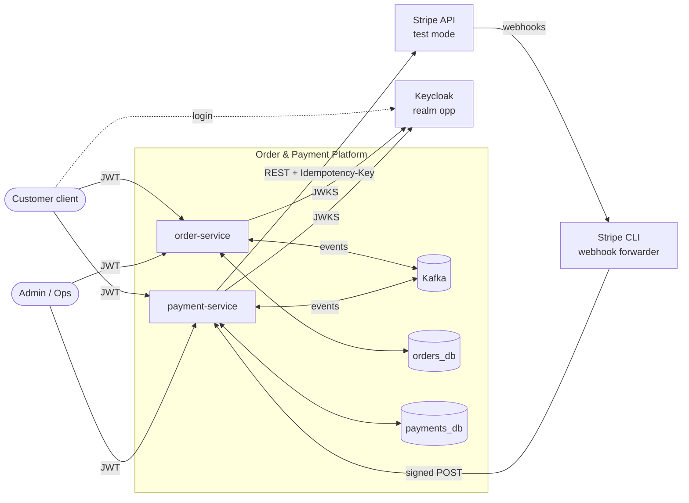
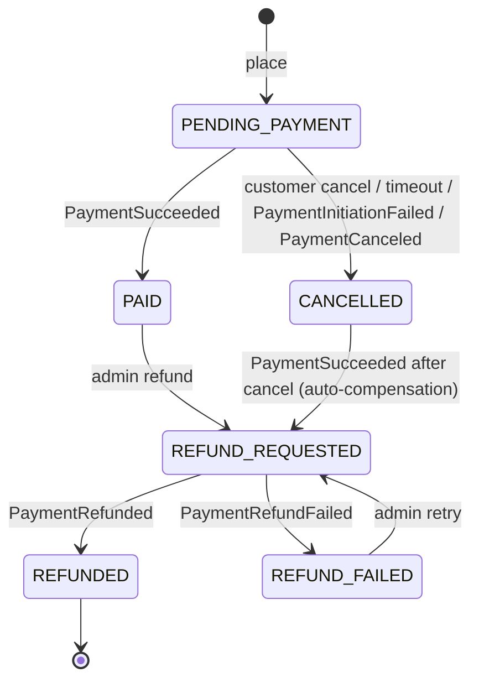
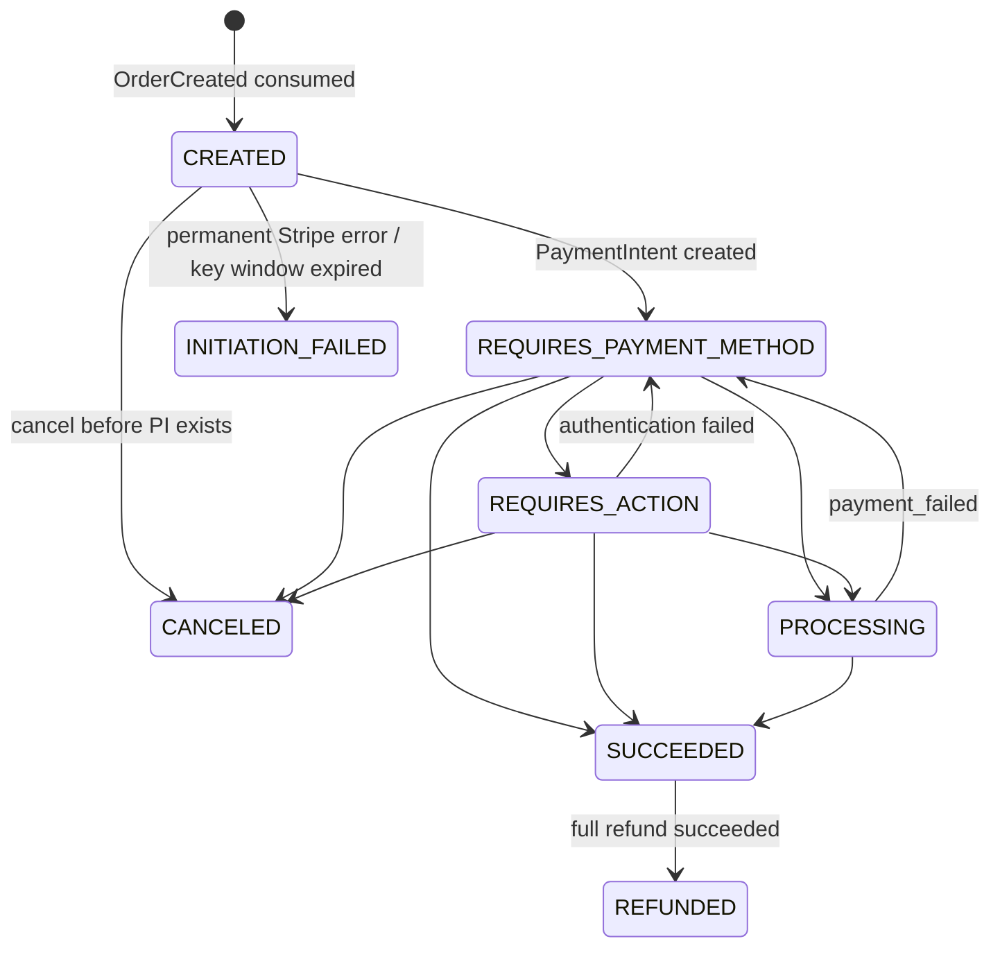
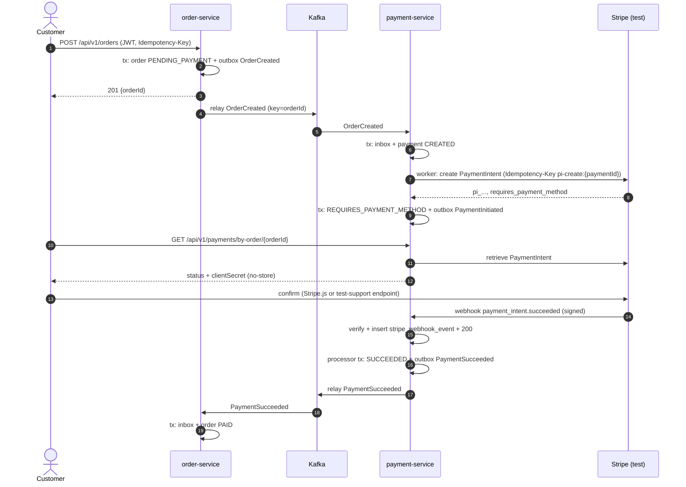
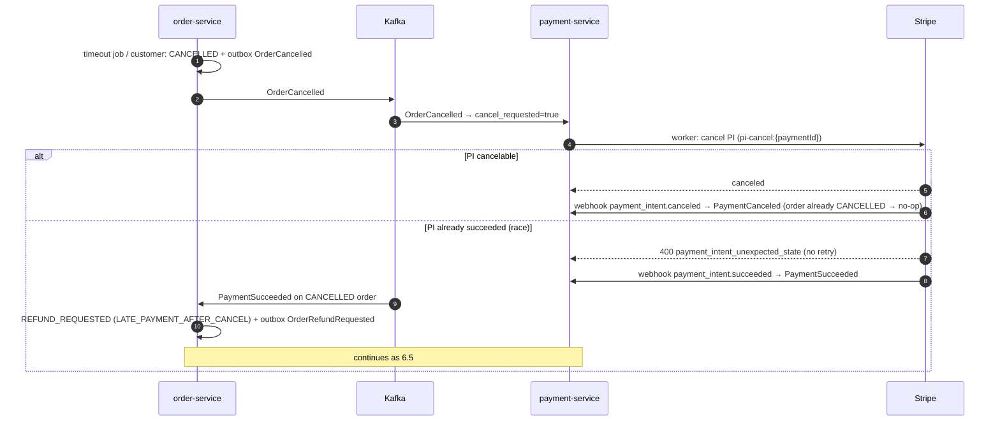
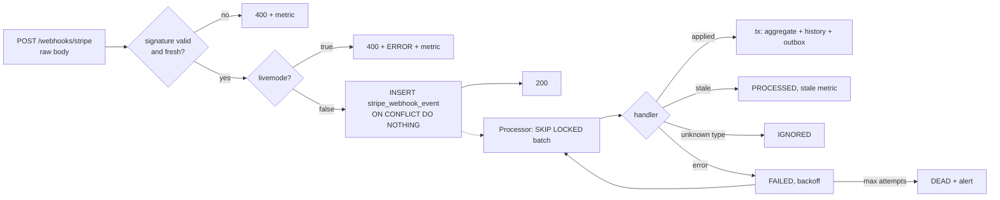

# Architecture — Order & Payment Integration Platform

Status: v1 (baseline for implementation). Owner: Alex Gorbatov / Altronixsoft OÜ.

## 1. Purpose & Scope

Reference implementation of a reliable order → payment integration with Stripe (test mode), built to demonstrate production-grade integration engineering: event-driven sagas, effectively-once business effects over at-least-once delivery, secure webhook ingestion, and full testability without a Stripe account.

**In scope**
- Two services: `order-service`, `payment-service`, communicating only via Kafka.
- Stripe PaymentIntents: create, confirm (test support), cancel, full refund, disputes (notification only).
- Stripe webhooks: signature verification, deduplication, async processing, out-of-order tolerance.
- Transactional outbox, inbox (idempotent consumers), HTTP idempotency, retry topics, DLT with persistence and replay.
- Reconciliation with Stripe as a safety net for lost webhooks.
- Keycloak (OIDC/JWT) with RBAC and ownership checks.
- Testcontainers-based integration, E2E, and chaos tests; observability (traces, metrics, logs).

**Out of scope (v1)**
Partial refunds, multi-currency/FX, inventory, shipping, real frontend (optional demo page only), Avro/Schema Registry, Debezium CDC, Kubernetes manifests, multi-region, Stripe Connect, subscriptions.

## 2. Quality Goals

| Priority | Goal | Concretely |
|---|---|---|
| 1 | No double charge, no lost payment | ≤ 1 successful PaymentIntent per order; every Stripe state change eventually reflected locally |
| 2 | No lost events | Outbox + at-least-once delivery + reconciliation |
| 3 | Effectively-once effects | Inbox, idempotency keys at every boundary, monotonic state machines |
| 4 | Security | Signed webhooks, JWT + RBAC + ownership, test-mode guard, no secrets/PAN in system |
| 5 | Testability | Every failure mode in §15 covered by an automated test without real Stripe |
| 6 | Operability | Metrics, traces across async boundaries, DLT replay, runbooks |

## 3. System Context



No synchronous service-to-service calls. Locally, webhooks reach `payment-service` via Stripe CLI (`stripe-test` profile) or via the test signer script (`local` profile).

## 4. Repository & Module Structure

```
libs/event-contracts                 envelope, event payload records, JSON Schemas (no Kafka deps)
libs/platform-messaging-starter      outbox, relay, inbox, Kafka error handling, DLT persister, dead-letter admin API
libs/platform-idempotency-starter    @Idempotent HTTP support
services/order-service               port 8081, DB orders_db
services/payment-service             port 8082, DB payments_db
e2e-tests                            cross-service scenarios
infra                                docker-compose, keycloak realm, prometheus/grafana/otel configs
scripts                              token.sh, ops-token.sh, send-test-webhook.sh, demo.sh
docs                                 architecture.md, events.md, adr/, runbooks/, testing.md, demo.md
```

Hexagonal layout per service: `domain`, `application`, `adapter.in.{web,kafka,webhook,job}`, `adapter.out.{persistence,stripe,messaging}`, `config`. `adapter.in.job` holds scheduled triggers of use cases (e.g. `PaymentTimeoutJob`); the schedule itself is wired in `config`. Starters are Spring Boot auto-configurations; they ship their own Flyway migrations under `db/migration/platform` (versions `V1000+`).

## 5. Domain Model

### 5.1 Order



- `PaymentAttemptFailed` / `PaymentActionRequired` do **not** change order status: a PaymentIntent can be retried by the customer with another payment method until timeout.
- `PaymentDisputed` sets flag `disputed=true` (no state change).
- Prices come only from the server-side catalog; the client sends `sku` + `quantity`. 1–20 lines, quantity 1–10, single currency (EUR in seed data).
- Every transition writes `order_status_history` (source: API | EVENT | JOB, source event id).

**Implementation notes (order-service domain, T07).** The aggregate `Order` is plain Java; each command (`place`, `markPaid`, `cancel(reason)`, `requestRefund(reason, refundRequestId)`, `markRefunded`, `markRefundFailed`, `markDisputed`) checks first and changes afterwards, so a rejected command (`IllegalOrderTransitionException`) leaves status, history and events untouched. An accepted one moves the status, appends a history entry and registers one domain event, which the application layer hands to the outbox in the saving transaction (T09). Details the diagram leaves implicit:
- `requestRefund` couples the reason to the status it comes from: `LATE_PAYMENT_AFTER_CANCEL` only from `CANCELLED` (automatic compensation), `ADMIN` from `PAID` and from `REFUND_FAILED` (retry), never `ADMIN` from `CANCELLED`. Refunds are always for the full order total (§5.3).
- A dispute sets the flag in any status and writes a history entry with `from_status = to_status` and reason `DISPUTED`; repeating it changes nothing.
- A SKU may appear on one line only (the limits are checked on the lines after price lookup); quantity 1–10 and 1–20 lines are enforced by the domain, prices and names are copied from the catalog into `order_item` at ordering time.
- Persistence: `@Version` plus a version check in `save`; the repository returns a fresh `Order` with the new version, and only that instance may be changed further.

### 5.2 Payment



Terminal: `SUCCEEDED` (except → `REFUNDED`), `CANCELED`, `INITIATION_FAILED`, `REFUNDED`.
Mapping from Stripe `PaymentIntent.status`: `requires_payment_method`, `requires_confirmation` → `REQUIRES_PAYMENT_METHOD`; `requires_action` → `REQUIRES_ACTION`; `processing` → `PROCESSING`; `succeeded` → `SUCCEEDED`; `canceled` → `CANCELED`; `requires_capture` → configuration error (manual capture is not used).
Disputes set `disputed=true`.

### 5.3 Refund

`REQUESTED` → `PENDING` (Stripe refund created) → `SUCCEEDED` | `FAILED`. Full refunds only. One refund per `refundRequestId` (unique).

**Implementation notes (payment-service domain and persistence, T10).**
- *Two kinds of change.* What Stripe **reports** (webhook, API response, reconciliation) goes through `Payment.applyStripeStatus(stripeStatus, observedAt, source)` and returns a `StripeOutcome`, never an exception: `APPLIED` (moved), `UNCHANGED` (current and consistent, same status — for example a second decline on an intent that never left `requires_payment_method`; the watermark `lastStripeEventAt` still advances) or `STALE_IGNORED` (older than the watermark, or not an allowed transition, which includes everything after a terminal status). `observedAt >= lastStripeEventAt` is deliberately inclusive: Stripe timestamps have one-second resolution, so a late `processing` in the same second as `succeeded` is rejected by the transition rule, not by the clock. What we **decide** (`create`, `attachPaymentIntent`, `markInitiationFailed`, `requestCancel`) are commands and throw `IllegalPaymentTransitionException` when the status does not fit. `requires_capture` raises `StripeConfigurationException` (retrying cannot help; alert), any other unmapped status `UnknownStripeStatusException`.
- *Cancel.* Before a PaymentIntent exists `requestCancel` cancels on the spot (`CREATED → CANCELED`, source `LOCAL`). Afterwards it only sets `cancel_requested` and schedules the cancellation worker; the payment becomes `CANCELED` when Stripe reports it. A `PROCESSING` or `SUCCEEDED` payment cannot be cancelled (`NOT_CANCELABLE`): that race is the order service's late-payment compensation (F18).
- *Work queue.* `next_attempt_at != null` means external work is due: PaymentIntent creation while `CREATED`, cancellation while `cancel_requested`, refund creation while `REQUESTED`, processing of a stored webhook event while `RECEIVED`/`FAILED`. `RetryPolicy` is `min(maxDelay, base · 2^(n−1))` reduced by up to `jitter` (default 2 s, cap 5 min, 8 attempts, 20 %); `scheduleRetry` counts the failure and returns `EXHAUSTED` after `maxAttempts`, whereupon the caller decides the terminal state (initiation → `INITIATION_FAILED`, refund → `FAILED`; a webhook event becomes `DEAD`). Reaching a status with nothing left to do clears the work.
- *Claiming.* `claimDueBatch(status, now, limit)` is a native `SELECT … ORDER BY next_attempt_at, id LIMIT n FOR UPDATE SKIP LOCKED` and must run inside a transaction (`Propagation.MANDATORY`). The row locks end with that transaction, so a worker claims **and leases** in the same transaction (`leaseUntil(now + lease)`, save, commit), calls Stripe outside any transaction, and stores the result in a new one; a worker that dies leaves a lease that simply expires. A slow worker whose lease expired meets the optimistic lock when it reports.
- *Uniqueness* is the database's, with named constraints that the adapter turns into `DuplicatePaymentException` / `DuplicateRefundException`: one payment per order (`payment_order_id_key`), one payment per PaymentIntent, one refund per `refundRequestId`, one per Stripe refund, and — so the money cannot go back twice when two requests race — at most one refund per payment that has not failed (`refund_one_open_per_payment`, a partial unique index). A `CHECK` requires a PaymentIntent from `REQUIRES_PAYMENT_METHOD` on, and `stripe_webhook_event.livemode` must be false.

**Implementation notes (payment initiation, T12).**
- *Consuming.* `OrderEventListener` (`order.events.v1`, group `payment-service`, deduplicated by `InboxGuard`) hands each event to `ApplyOrderEventService`, which only writes state: `OrderCreated` → `Payment(CREATED, next_attempt_at = now)` (a second `OrderCreated` for the same order is ignored: the unique key on `order_id` answers F22 even under a new event id); `OrderCancelled` → `requestCancel` (a payment without a PaymentIntent is cancelled on the spot and never reaches Stripe, otherwise `cancel_requested = true` for the cancellation worker, T14; a `PROCESSING`/`SUCCEEDED` payment is left alone, F18); `OrderRefundRequested` → `Refund(REQUESTED)` (deduplicated by `refundRequestId`; for the refund worker, T14). A cancellation or refund for an order without a payment throws a retryable `PaymentNotFoundException` — `OrderCreated` may still be on a retry topic — and ends in the dead-letter topic if it never arrives; a refund the payment's state cannot explain (not `SUCCEEDED`, or not the full amount) is non-retryable and goes to the dead-letter topic at once.
- *Tracing.* `payment.correlation_id` and `caused_by_event_id` (and the same on `refund`) store the flow and the consumed event that started the payment, so the worker — which runs long after the consumer — publishes `PaymentInitiated`/`PaymentInitiationFailed` with the right `correlationId` and `causationId` (migration `V2__trace_ids.sql`).
- *Initiation.* `PaymentInitiationWorker` = `InitiatePaymentsService.runBatch()` driven by `PaymentInitiationJob` (fixed delay `payment.initiation.interval`, switch `payment.initiation.enabled`): claim and lease a batch in one transaction, call `createPaymentIntent` (key `pi-create:{paymentId}`) **outside** any transaction, record the result in a new transaction with the outbox event; failures per ADR-0008 (addendum), including the 23-hour rule (F08). Metrics `payment.initiation{outcome}` and `payment.order.events{type,outcome}`.
- *API.* `GET /api/v1/payments/by-order/{orderId}`: the owner or an admin; a foreign payment is a 404 like a missing one. `clientSecret` is given only to the **owner** (never to an admin), only while the payment is `REQUIRES_PAYMENT_METHOD`/`REQUIRES_ACTION` *and* Stripe still says so; it is fetched with `retrieve` on every request, never stored and never logged, and the response is `Cache-Control: no-store`. If Stripe cannot be asked the answer is `503` + `Retry-After` (transient) or `502`. Errors are RFC 9457 problems with `type = urn:problem-type:<code>`: `payment-not-found` (404), `payment-not-confirmable` (409), `payment-provider-unavailable` (503), `payment-provider-error` (502), plus the generic ones of order-service.
- *Test support.* `POST /api/v1/test-support/payments/by-order/{orderId}/confirm?scenario=success|decline|insufficient_funds|requires_3ds|dispute|refund_fail` (role `customer`, owner only) confirms the PaymentIntent with the Stripe test payment method of the scenario (`pm_card_visa`, `pm_card_chargeDeclined`, `pm_card_chargeDeclinedInsufficientFunds`, `pm_card_authenticationRequired`, `pm_card_createDispute`, `pm_card_refundFail`) and **changes nothing in the database**: the result arrives as a webhook (T13) through the same pipeline as a real payment. `202` with `accepted=false` and the decline code if the card was refused. The controller and its service exist only if `platform.test-support.enabled=true` (profiles `local` and `stripe-test`); otherwise the endpoint is a plain 404/405 and there is no bean.
- *Security* duplicates order-service's configuration on purpose (resource server, `aud=payment-service`, realm roles, problem-JSON 401/403). If a third service appears it should move into a shared starter — that needs its own ADR (ADR-0014 covers messaging and idempotency only).

## 6. Key Flows

### 6.1 Happy path



### 6.2 Failed attempt and retry

`payment_intent.payment_failed` → Payment `REQUIRES_PAYMENT_METHOD`, `last_error_*` stored → `PaymentAttemptFailed`. Order stays `PENDING_PAYMENT`. Customer confirms again on the same PaymentIntent → `succeeded` → 6.1 tail. If no success before timeout → 6.4.

### 6.3 Strong customer authentication (3DS)

Confirm with a 3DS test card → `payment_intent.requires_action` → `PaymentActionRequired` (order unchanged; client completes `next_action` via Stripe.js) → `succeeded` or `payment_failed`.

### 6.4 Cancellation and the late-success race



Payment in `CREATED` (no PI yet) is cancelled locally without a Stripe call.

**Payment timeout (order-service).** `PaymentTimeoutJob` runs with a fixed delay and cancels orders that have been `PENDING_PAYMENT` for longer than `order.payment-timeout` (default `PT30M`, `PT3M` in the `local` profile) with reason `TIMEOUT`. It claims the oldest overdue orders in batches with `FOR UPDATE SKIP LOCKED` (partial index on `orders(created_at) WHERE status = 'PENDING_PAYMENT'`), one transaction per batch, so several instances never cancel the same order. Every `OrderCancelled` of one run carries the run's `correlationId`. A payment that succeeds after the timeout is compensated exactly like a customer cancellation (F18).

### 6.5 Refund

Admin `POST /orders/{id}/refund` (or auto-compensation) → `REFUND_REQUESTED` + `OrderRefundRequested{refundRequestId}` → payment-service creates `Refund(REQUESTED)` → worker calls Stripe (`refund:{refundId}`) → `PENDING` → webhook → `SUCCEEDED` (Payment `REFUNDED`, `PaymentRefunded` → order `REFUNDED`) or `FAILED` (`PaymentRefundFailed` → order `REFUND_FAILED`, admin may retry with a new `refundRequestId`).

### 6.6 Webhook pipeline



### 6.7 Order-side handling of payment events

order-service consumes `payment.events.v1` as group `order-service`; every event runs once per `eventId` inside the inbox transaction (§7.2). Events arrive at least once and, through the retry topics, not always in order (§7.4), so each rule checks the order's status first. Anything a duplicate or a race explains is a no-op (`IGNORED`, logged and counted); anything else is a `NonRetryableEventException` and goes straight to the DLT (F15).

| Event | Applied when the order is | Effect | No-op when | DLT when |
|---|---|---|---|---|
| `PaymentSucceeded` | `PENDING_PAYMENT` | → `PAID` | already `PAID` / `REFUND_*` (duplicate) | — |
| `PaymentSucceeded` | `CANCELLED` | → `REFUND_REQUESTED(LATE_PAYMENT_AFTER_CANCEL)` + `OrderRefundRequested` (F18) | — | — |
| `PaymentInitiationFailed` | `PENDING_PAYMENT` | → `CANCELLED(PAYMENT_INITIATION_FAILED)` + `OrderCancelled` | any other status | — |
| `PaymentCanceled` | `PENDING_PAYMENT` | → `CANCELLED(PAYMENT_CANCELED)` + `OrderCancelled` | any other status (usually the echo of a customer/timeout cancel) | — |
| `PaymentAttemptFailed`, `PaymentActionRequired` | `PENDING_PAYMENT` | history entry only; the customer may retry on the same PaymentIntent (§6.2, §6.3) | any other status | — |
| `PaymentRefunded` | `REFUND_REQUESTED`, same `refundRequestId` | → `REFUNDED` | already `REFUNDED`; outcome of an older `refundRequestId` | no refund ever requested; contradicts the order (`REFUND_FAILED`) |
| `PaymentRefundFailed` | `REFUND_REQUESTED`, same `refundRequestId` | → `REFUND_FAILED` | already `REFUND_FAILED`; outcome of an older `refundRequestId` | no refund ever requested; contradicts the order (`REFUNDED`) |
| `PaymentDisputed` | any status | `disputed = true` | already disputed | — |
| any | — | — | — | unknown `orderId` |

`PaymentInitiated` needs no reaction; unknown event types are skipped (§9.3). The order remembers its latest `refundRequestId`, so the outcome of a refund that an administrator has already retried cannot overwrite the newer request. Status changes caused by an event record its `eventId` in `order_status_history.source_event_id`; events published in response carry the consumed event's `correlationId`, and its `eventId` as `causationId`. Metric: `order.payment.events{type, outcome=APPLIED|COMPENSATED|IGNORED|DUPLICATE|REJECTED}`.

## 7. Reliability Patterns

### 7.1 Transactional outbox
Business change and `outbox_event` row are written in one DB transaction (`OutboxPublisher` requires an active transaction). `OutboxRelay` polls with `FOR UPDATE SKIP LOCKED`, sends to Kafka (`acks=all`, `enable.idempotence=true`), waits for acknowledgement, marks `published_at`. On failure the batch stops (preserves per-key order); attempts and last error are recorded. Crash after send and before commit ⇒ duplicate publish ⇒ handled by inbox. Published rows are deleted after 7 days. Alternative (Debezium CDC) rejected for scope — ADR-0004.

### 7.2 Inbox (idempotent consumer)
`INSERT INTO inbox_message(consumer_group, event_id) ON CONFLICT DO NOTHING` in the **same** transaction as the business change. Zero rows inserted ⇒ duplicate ⇒ skip. Inbox retention (14 days) exceeds topic retention (7 days), so any redelivery is still detected.

### 7.3 Idempotency layers

| Boundary | Mechanism | Key | Storage | Window |
|---|---|---|---|---|
| Client → API | `Idempotency-Key` header + request hash | (principal, key) | `idempotency_record` | 24 h |
| Service → Stripe | Stripe `Idempotency-Key` | `pi-create:{paymentId}`, `pi-cancel:{paymentId}`, `refund:{refundId}` | Stripe | 24 h (Stripe-defined) |
| Stripe → webhook | Event id dedupe | `evt_...` | `stripe_webhook_event` PK | 30 days |
| Kafka → consumer | Inbox | (group, eventId) | `inbox_message` | 14 days |
| Relay → Kafka | Idempotent producer | producer id/sequence | Kafka | producer session |
| Business | State machine + `@Version` | aggregate version | aggregate tables | — |

HTTP semantics: same key + same hash ⇒ replay stored response (`Idempotent-Replayed: true`); same key + different hash ⇒ 422; in progress ⇒ 409 + `Retry-After`; 5xx ⇒ record removed so the client may retry.

### 7.4 Retries and dead letters
Consumers: `ErrorHandlingDeserializer`; short blocking retry (2 × 200 ms) then non-blocking retry topics (1 s, 10 s, 60 s) then `<topic>-dlt`. Non-retryable (deserialization, validation, `NonRetryableEventException`) go straight to DLT. A DLT listener persists every dead letter to `dead_letter_message`; ops can list, replay (re-published through the outbox to the original topic, header `x-replay-of`), or resolve. Trade-off: retry topics break per-key ordering; accepted because consumers are order-tolerant (inbox + monotonic state machines) — ADR-0007.

### 7.5 Ordering
Partition key = `orderId` on both topics ⇒ per-order ordering within a topic. Cross-topic ordering is not guaranteed and not relied upon. Stripe webhook order is not guaranteed — handled in §8.3.

### 7.6 DB-backed work queues for external calls
Kafka consumers and webhook ingress only write state. Stripe calls are made by scheduled workers that claim due rows (`status`, `next_attempt_at`) with `FOR UPDATE SKIP LOCKED`, call Stripe **outside** a transaction, then persist the result in a new transaction. Transient errors ⇒ exponential backoff with jitter; permanent ⇒ terminal state + event. Workers: `PaymentInitiationWorker`, `PaymentCancellationWorker`, `RefundWorker`, `WebhookProcessor`, `ReconciliationJob`. Safe with multiple instances — ADR-0008.

## 8. Stripe Integration

### 8.1 Modes

| Profile | Stripe API | Webhooks | Account needed | Used by |
|---|---|---|---|---|
| tests | WireMock (scenarios) + `stripe/stripe-mock` (contract smoke) | signed in-test via `StripeWebhookTestSigner` | no | CI |
| `local` | `stripe-mock` | `scripts/send-test-webhook.sh` (signs fixtures with local secret) | no | dev |
| `stripe-test` | real Stripe, `sk_test_` key | Stripe CLI `listen --forward-to` | yes (free test account) | demo |

`stripe-mock` is stateless (no transitions, no webhooks) — hence WireMock for scenario control.

### 8.2 Gateway
Port `PaymentGateway` (create/retrieve/cancel PI, create refund, test-only confirm). Adapter uses `StripeClient` with explicit timeouts, `maxNetworkRetries=2`, Resilience4j circuit breaker (only transient errors count). PaymentIntent: `amount` (minor), `currency`, `automatic_payment_methods.enabled=true` with `allow_redirects=never`, `metadata{orderId, paymentId}`.
Error classes: TRANSIENT (connection, 5xx, 429, idempotency in-progress), PERMANENT (400 invalid request, card errors), CONFIG (401/403 — alert, no blind retry), IDEMPOTENCY_MISMATCH (bug — alert).
Idempotency keys expire after 24 h: a payment still in `CREATED` after 23 h is moved to `INITIATION_FAILED` rather than retried with a fresh key (which could create a second PaymentIntent).
`LiveModeGuard` refuses to start with a non-test key.

**Implementation notes (Stripe adapter, T11; details and the reconciliation with current Stripe documentation are in ADR-0012).** The SDK retries timeouts, 409 and ≥ 500 itself (same idempotency key, up to `maxNetworkRetries`), but not 429, which is therefore left to the work queue's backoff; a gateway call can make up to three HTTP requests. Errors are classified by HTTP status and error `type`/`code` (409 and `idempotency_key_in_use` are TRANSIENT, `idempotency_error` is `IDEMPOTENCY_MISMATCH`). Stripe prunes idempotency keys after *at least* 24 hours, so the 23 h cutoff above is deliberately conservative. The circuit breaker is shared by all operations; while it is open calls fail fast with a TRANSIENT `PaymentGatewayException` (`circuitOpen()`), and workers back off without counting a Stripe failure. Metrics `stripe.api.latency{operation,outcome}` and `stripe.api.errors{type}`; the Stripe `Request-Id` is logged, secrets never.

### 8.3 Webhooks
Raw body verified with `Stripe-Signature` (HMAC-SHA256, tolerance 300 s), multiple secrets supported for rotation, body ≤ 256 KB, `livemode=true` rejected. Persist-then-ack; processing is asynchronous (§6.6).
Verification uses the SDK (`Webhook.constructEvent`) with the service's clock and tries every secret of `stripe.webhook.signing-secrets` (`STRIPE_WEBHOOK_SECRET`, comma-separated), so a secret can be rolled without a gap. Refusals: bad/old/missing signature ⇒ 400 + `webhook.signature.failures{reason}`; `livemode=true` ⇒ 400 + ERROR + `webhook.livemode.rejected`; body > 256 KB ⇒ 413. Nothing refused is stored.
**Ordering rule:** each Payment stores `last_stripe_event_at`. An event is applied only if `event.created ≥ last_stripe_event_at` **and** the transition is allowed; otherwise the report is stale (outcome `STALE_IGNORED` of `applyStripeStatus`, not an error): the payment is untouched, the webhook event is still marked `PROCESSED` — it *was* processed, there is nothing to retry — and `webhook.stale.ignored` counts it. Terminal states are never left except `SUCCEEDED → REFUNDED`.
Handled types (checked against docs.stripe.com/api/events/types): `payment_intent.processing`, `payment_intent.requires_action`, `payment_intent.payment_failed`, `payment_intent.succeeded`, `payment_intent.canceled` (object: PaymentIntent; its `status` is applied), `charge.refunded` (object: the charge; full refunds only), `refund.failed` (object: the refund), `charge.dispute.created` (object: the dispute). Others ⇒ `IGNORED`. `data.object` is read as plain JSON, so an event rendered with another API version works as long as these fields exist.
Lookup: payments by `payment_intent` id, fallback `metadata.paymentId`; refunds by Stripe refund id, fallback `metadata.refundId`; unknown object ⇒ `IGNORED` + WARN. An object whose PaymentIntent or Stripe refund id the platform has not recorded yet (the worker that created it has not committed) fails the attempt, so it is retried with backoff.
Effects, in one transaction with the event's new status: reaching `REQUIRES_ACTION` / `SUCCEEDED` / `CANCELED` publishes `PaymentActionRequired` / `PaymentSucceeded` / `PaymentCanceled` (whatever reported it); `payment_failed` stores `last_payment_error.code`, `decline_code` and `message` (sanitized: Stripe-shaped codes only, no control characters, card-number-like digits or secrets, ≤ 500 chars) and publishes `PaymentAttemptFailed` for every failed attempt, also when the status does not move; `charge.refunded` completes the open refund and publishes `PaymentRefunded`; `refund.failed` fails it and publishes `PaymentRefundFailed`; a dispute sets `disputed` and publishes `PaymentDisputed` once. Operations: [runbooks/webhooks.md](runbooks/webhooks.md).

### 8.4 Reconciliation
Every 5 min: payments in non-terminal states not updated for 10 min with a PI id ⇒ `retrieve` ⇒ apply via the same state machine (source `RECONCILIATION`). Drift is logged and counted (it means a webhook was lost or late). Rate-limited. Manual trigger: `POST /admin/reconciliation/run`.

### 8.5 Test payment methods
Used by the test-support confirm endpoint and the demo (verify IDs against docs.stripe.com/testing): success `pm_card_visa`; generic decline `pm_card_chargeDeclined`; insufficient funds `pm_card_chargeDeclinedInsufficientFunds`; 3DS required `pm_card_authenticationRequired`; dispute `pm_card_createDispute`; refund failure `pm_card_refundFail`.

## 9. Messaging Contracts

### 9.1 Topics

| Topic | Producer | Consumer group | Key | Partitions (local/prod) | Retention |
|---|---|---|---|---|---|
| `order.events.v1` | order-service | `payment-service` | orderId | 3 / 6 | 7 d |
| `payment.events.v1` | payment-service | `order-service` | orderId | 3 / 6 | 7 d |
| `<topic>-retry-*`, `<topic>-dlt` | Spring Kafka | DLT persister | orderId | as source | 14 d |

### 9.2 Envelope (JSON)

```json
{
  "eventId": "uuidv7",
  "eventType": "PaymentSucceeded",
  "eventVersion": 1,
  "aggregateType": "Payment",
  "aggregateId": "uuid",
  "partitionKey": "orderId",
  "occurredAt": "2026-10-08T12:00:00Z",
  "producer": "payment-service",
  "correlationId": "uuid",
  "causationId": "uuid-of-triggering-event-or-request",
  "payload": { }
}
```

`correlationId` starts at the edge: the `X-Correlation-Id` request header when it is a UUID, otherwise a new one (echoed in the response); consumers pass the consumed event's id on, and a scheduled job uses one id per run. `causationId` is the consumed event that caused the change; it is absent for API calls and jobs.

Kafka headers: `eventType`, `eventVersion`, `correlationId`, `traceparent`. Versioning: additive changes keep the version; breaking changes introduce a new version, published in parallel during migration. JSON Schemas live in `libs/event-contracts` — ADR-0011.

### 9.3 Events

| Event | Producer | Payload |
|---|---|---|
| OrderCreated | order | orderId, customerId, amountMinor, currency, itemCount |
| OrderCancelled | order | orderId, reason (CUSTOMER, TIMEOUT, PAYMENT_INITIATION_FAILED, PAYMENT_CANCELED) |
| OrderRefundRequested | order | orderId, refundRequestId, amountMinor, currency, reason (ADMIN, LATE_PAYMENT_AFTER_CANCEL) |
| PaymentInitiated | payment | paymentId, orderId, stripePaymentIntentId |
| PaymentInitiationFailed | payment | paymentId, orderId, errorCode |
| PaymentActionRequired | payment | paymentId, orderId |
| PaymentAttemptFailed | payment | paymentId, orderId, errorCode, declineCode (sanitized) |
| PaymentSucceeded | payment | paymentId, orderId, amountMinor, currency, stripePaymentIntentId, succeededAt |
| PaymentCanceled | payment | paymentId, orderId, reason |
| PaymentRefunded | payment | paymentId, orderId, refundRequestId, stripeRefundId, amountMinor |
| PaymentRefundFailed | payment | paymentId, orderId, refundRequestId, failureReason |
| PaymentDisputed | payment | paymentId, orderId, disputeId, reason |

Unknown event types are skipped (forward compatibility), not dead-lettered.

## 10. Data Model

**Platform tables (from starters, in each service DB)**
- `outbox_event(id, aggregate_type, aggregate_id, partition_key, topic, event_type, event_version, payload jsonb, headers jsonb, created_at, published_at, attempts, last_error)` — partial index `WHERE published_at IS NULL`. `id` is the envelope `eventId`; `payload` holds the complete event envelope (it is the Kafka record value), `headers` the Kafka headers to send — ADR-0004.
- `inbox_message(consumer_group, event_id, received_at)` — PK (consumer_group, event_id).
- `dead_letter_message(id, original_topic, dlt_topic, partition, "offset", message_key, payload, headers jsonb, exception_class, exception_message, status NEW|REPLAYED|RESOLVED, note, created_at, updated_at)`. `partition`/`offset` are the coordinates of the record on the DLT topic (unique); `original_partition`/`original_offset` those of the failing record; `payload` is `bytea` (poison messages need not be text) — ADR-0007.
- `idempotency_record(principal, idem_key, request_hash, status IN_PROGRESS|COMPLETED, response_status, response_headers jsonb, response_body, created_at, expires_at)` — PK (principal, idem_key). `response_body` is `bytea`; an `IN_PROGRESS` record older than the in-progress timeout counts as abandoned and may be taken over — ADR-0006.

**orders_db**
- `product(sku PK, name, price_minor, currency, active)` + seed.
- `orders(id, customer_id, status, currency, total_minor, cancel_reason, refund_request_id, disputed, created_at, updated_at, version)` — `refund_request_id` is the latest refund request (stale refund outcomes are recognised by it, §6.7); partial index on `created_at WHERE status = 'PENDING_PAYMENT'` for the payment timeout.
- `order_item(id, order_id FK, sku, name, quantity, unit_price_minor, line_total_minor)`.
- `order_status_history(id, order_id, from_status, to_status, reason, source, source_event_id, occurred_at)`.

**payments_db**
- `payment(id, order_id UNIQUE, customer_id, amount_minor, currency, status, stripe_payment_intent_id UNIQUE, last_stripe_event_at, last_error_code, last_decline_code, last_error_message, cancel_requested, cancel_sent_at, disputed, attempts, next_attempt_at, created_at, updated_at, version, correlation_id, caused_by_event_id)`.
- `refund(id, payment_id FK, refund_request_id UNIQUE, amount_minor, currency, reason, status, stripe_refund_id UNIQUE, failure_reason, attempts, next_attempt_at, created_at, updated_at, version, correlation_id, caused_by_event_id)`.
- `payment_status_history(id, payment_id, from_status, to_status, source STRIPE_API|WEBHOOK|RECONCILIATION|LOCAL, stripe_event_id, occurred_at)`.
- `stripe_webhook_event(event_id PK, type, api_version, livemode, stripe_created_at, payload jsonb, status RECEIVED|PROCESSED|IGNORED|FAILED|DEAD (the constraint also admits STALE_IGNORED, which is not written: a stale report ends PROCESSED, §8.3), attempts, next_attempt_at, last_error, received_at, processed_at)`.

Retention: outbox 7 d (published), inbox 14 d, webhook events 30 d, idempotency 24 h.

## 11. API

**order-service (8081)**

| Method | Path | Role | Idempotency-Key | Notes |
|---|---|---|---|---|
| GET | `/api/v1/products` | any authenticated | — | catalog |
| POST | `/api/v1/orders` | customer | required | body: items[{sku, quantity}] |
| GET | `/api/v1/orders/{id}` | owner, admin | — | foreign order ⇒ 404 |
| GET | `/api/v1/orders` | customer (own), admin (all) | — | page/size ≤ 100 |
| POST | `/api/v1/orders/{id}/cancel` | owner | required | only PENDING_PAYMENT |
| POST | `/api/v1/orders/{id}/refund` | admin | required | PAID or REFUND_FAILED |

**payment-service (8082)**

| Method | Path | Role | Notes |
|---|---|---|---|
| GET | `/api/v1/payments/by-order/{orderId}` | owner, admin | clientSecret only when actionable; `Cache-Control: no-store` |
| POST | `/webhooks/stripe` | public (signature) | raw body, ≤ 256 KB (413 above); 400 for an invalid signature or a live-mode event; 200 also for a redelivery |
| POST | `/api/v1/test-support/payments/by-order/{orderId}/confirm?scenario=` | owner | bean exists only if `platform.test-support.enabled=true` |
| POST | `/admin/reconciliation/run`, GET `/admin/reconciliation/last` | ops | |

**Both services:** `GET /admin/dead-letters`, `GET /admin/dead-letters/{id}`, `POST /admin/dead-letters/{id}/replay`, `POST /admin/dead-letters/{id}/resolve` (ops). Actuator: `health`, `info` public; `prometheus` and the rest restricted. Errors: RFC 9457 ProblemDetail.

**Implementation notes (order-service API, T08).**
- *Who may call what* is decided per endpoint in the security filter chain (`SecurityConfiguration`); *which orders* a caller may see is decided in the use cases (`Caller`: `sub` plus an admin flag). A customer asking for an order that is not theirs gets exactly the 404 of a missing id. Roles: `GET /products` any authenticated caller; `POST /orders`, `POST /orders/{id}/cancel` role `customer` (an admin cannot cancel on a customer's behalf); `GET /orders[/{id}]` `customer` (own) or `admin` (all); `POST /orders/{id}/refund` `admin`. `ops` has no business endpoints, only actuator and (later) the admin endpoints.
- *Tokens*: signature (JWKS, RS256 only), `iss`, `exp`/`nbf` and `aud=order-service` are validated; the realm roles `customer|admin|ops` become `ROLE_*`, every other realm role grants nothing. The JWKS location is configured separately (`KEYCLOAK_JWK_SET_URI`) from the issuer (`KEYCLOAK_ISSUER_URI`), because inside a container network Keycloak is reached under another name than the one tokens carry. Stateless, no CSRF, no cookies; 401 carries `WWW-Authenticate: Bearer`.
- *Responses*: `201` + `Location` for create, `200` for cancel, `202` for refund (the money moves asynchronously); an order carries its lines (name and price as copied from the catalog) and its status history; a list holds summaries. Lists are `{content, page, size, totalElements, totalPages}`, `page` counted from 0, `size` 1–100 (default 20), always newest first (`createdAt` desc, id desc as tie-breaker).
- *Errors* are RFC 9457 problems, `Content-Type: application/problem+json`, `type = urn:problem-type:<code>`:

| Code | Status | When |
|---|---|---|
| `unauthorized` / `forbidden` | 401 / 403 | no valid token for this service / role missing |
| `validation-failed` | 400 | Bean Validation or a bad path/query value; `errors[] = {field, message}` |
| `malformed-request` | 400 | body missing, not JSON, or of the wrong shape (no echo of the input) |
| `invalid-order` | 400 | the request breaks a domain rule (duplicate SKU) |
| `order-not-found` | 404 | no such order, or not the caller's |
| `not-found`, `method-not-allowed`, `unsupported-media-type`, `not-acceptable` | 404, 405, 415, 406 | routing and content negotiation |
| `order-state-conflict` | 409 | illegal transition; `currentStatus` names the status |
| `concurrent-modification` | 409 | optimistic-lock conflict; fetch again and retry |
| `product-not-available` | 422 | unknown or discontinued SKU; `skus[]` |
| `internal-error` | 500 | anything unforeseen; logged, never detailed |

  The `Idempotency-Key` problems (400/409/422/413) are written by `platform-idempotency-starter` with its own `urn:opp:problem:*` types (ADR-0006); unifying the two prefixes is a follow-up.
- *Strict JSON*: unknown properties are ignored (so client-sent prices, totals and `customerId` never matter), but `1.5` or `"2"` are not a quantity.
- *Idempotency*: `POST /orders`, `/cancel` and `/refund` are `@Idempotent` (24 h). A replay returns the stored answer, even a 404 or 409; a genuinely new request meets the new state (cancelling twice with two keys is a 409).
- *OpenAPI*: `/v3/api-docs` (+ `.yaml`) and Swagger UI exist only with `springdoc.api-docs.enabled=true`, which only the `local` profile sets; elsewhere they are 401/404. The document declares the bearer scheme, the `Idempotency-Key` header and the problem responses with examples.
- *Not yet*: cancel and refund change the order but publish nothing — `OrderCancelled`/`RefundRequested` are registered on the aggregate and reach the outbox in T09.

## 12. Security

- Keycloak realm `opp`; realm roles `customer`, `admin`, `ops`.
- Clients: `opp-web` (public, PKCE; direct access grants enabled **only in the dev realm** for scripts), `opp-ops-cli` (confidential, client-credentials, service-account role `ops`).
- Audience mappers add `order-service` and `payment-service` to `aud`. Services validate signature (JWKS), `iss`, `exp`, `aud`; roles from `realm_access.roles` ⇒ `ROLE_*`.
- Ownership: `customerId = jwt.sub`; foreign resources return 404 (no existence disclosure).
- Webhook endpoint: no JWT; HMAC signature + timestamp tolerance + livemode guard + body limit; CSRF disabled for API and webhook paths (stateless).
- Secrets only from environment; `LiveModeGuard`; `client_secret` never stored or logged.
- Card data never touches the platform (Stripe Elements / test PaymentMethods) — minimal PCI scope.
- Deliberately no synchronous service-to-service calls ⇒ no service tokens between services — ADR-0013.

## 13. Observability

- **Tracing:** Micrometer Tracing + OpenTelemetry (OTLP → collector → Jaeger). `traceparent` is captured into outbox headers at write time and restored by the relay, so one trace spans HTTP → outbox → Kafka → consumer → Stripe call. Webhook processing starts a trace tagged with `stripe.event_id`, `stripe.event_type`, `payment.id`, `order.id`.
- **Logs:** structured JSON (ECS) with `traceId`, `spanId`, `correlationId`, `orderId`, `paymentId`.
- **Metrics:** `outbox.pending`, `outbox.oldest.age.seconds`, `outbox.publish.{success,failure}`, `inbox.duplicates`, `idempotency.{replays,conflicts}`, `webhook.received{type}`, `webhook.duplicates`, `webhook.signature.failures{reason}`, `webhook.livemode.rejected`, `webhook.processed{outcome}`, `webhook.processing.lag`, `webhook.stale.ignored`, `webhook.dead`, `stripe.api.latency{operation,outcome}`, `stripe.api.errors{type}`, `dlt.messages{topic}`, `reconciliation.{checked,drift}`, `order.payment.events{type,outcome}`, `payments.by.status`, `orders.by.status`.
- Grafana dashboard "OPP Overview" and alert rules in `infra/`.

## 14. Testing Strategy

| Level | Scope | Infrastructure | Stripe double |
|---|---|---|---|
| Unit | state machines, money, backoff, mappers | none (JUnit, jqwik) | — |
| Starter IT | outbox, inbox, DLT, idempotency | Testcontainers PG + Kafka | — |
| Service IT | API, security matrix, consumers, workers, webhooks | PG + Kafka + Keycloak | WireMock |
| Contract smoke | gateway request/response shape | stripe-mock container | stripe-mock |
| E2E + chaos | both services, sagas, failures from §15 | all containers | WireMock + signed webhooks |
| Architecture | layering rules | ArchUnit | — |
| Manual demo | real Stripe test mode | docker compose + Stripe CLI | real Stripe |

Global invariants asserted at the end of every E2E test: ≤ 1 succeeded PaymentIntent per order; payment amount = order total; no stuck outbox rows; no unexpected DEAD webhook events.

## 15. Failure Mode Matrix

| ID | Failure | Behaviour | Guarantee |
|---|---|---|---|
| F01 | Kafka down while orders are created | Orders committed, outbox rows accumulate, relay retries | Delivered after recovery, order preserved per key |
| F02 | Relay crashes after send, before marking published | Event re-published | Inbox dedupes |
| F03 | Consumer crashes after DB commit, before offset commit | Redelivery | Inbox dedupes |
| F04 | Stripe timeout on PI create | Worker retries with same idempotency key | Single PaymentIntent |
| F05 | Crash between Stripe response and local commit | Retry returns the same PI (idempotency key) | Single PaymentIntent |
| F06 | Stripe 5xx / 429 storm | Backoff, circuit breaker opens, payments wait in CREATED | Eventual initiation, no hammering |
| F07 | Stripe permanent 4xx on create | INITIATION_FAILED → order CANCELLED | Customer not charged |
| F08 | Payment stuck CREATED > 23 h | INITIATION_FAILED (no new key) | No second PI |
| F09 | Duplicate webhook delivery | PK conflict, 200, no effect | One state change, one event |
| F10 | Out-of-order webhooks | Stale event ignored by ordering rule | Monotonic state |
| F11 | Webhook lost / endpoint down | Reconciliation detects drift | Eventual consistency ≤ 15 min |
| F12 | Invalid signature / replayed old webhook | 400, not stored | No forged state changes |
| F13 | `livemode=true` event | 400 + alert | Test-only system |
| F14 | Webhook handler keeps failing | Backoff → DEAD + alert, runbook replay | No silent loss |
| F15 | Poison Kafka message | Retry topics → DLT → persisted → replay; an event the business state cannot explain (§6.7) skips the retries | No consumer blockage |
| F16 | Concurrent requests with same Idempotency-Key | One executes, others 409 or replay | One order |
| F17 | Same key, different body | 422 | No accidental reuse |
| F18 | Payment succeeds after order cancelled (by the customer or the payment timeout) | Auto refund (LATE_PAYMENT_AFTER_CANCEL) | Customer not charged for cancelled order |
| F19 | Cancel PI races with success | `unexpected_state` not retried, success handled as F18 | No stuck state |
| F20 | Refund fails | REFUND_FAILED, admin retry with a new refundRequestId; a late outcome of the older request is ignored | Visible, recoverable |
| F21 | Webhook and reconciliation update the same payment | Optimistic lock + state machine | One transition, one event |
| F22 | Duplicate OrderRefundRequested | Unique refund_request_id | One Stripe refund |

## 16. Local Environment & Profiles

Ports: order-service 8081, payment-service 8082, Keycloak 8180, Kafka 9092, kafka-ui 8085, PostgreSQL 5432, stripe-mock 12111, Prometheus 9090, Grafana 3000, Jaeger 16686.
Compose profiles: default (infra), `apps` (both services), `stripe-test` (real Stripe + Stripe CLI), `observability` (OTel collector, Jaeger, Prometheus, Grafana).
Spring profiles: `local` (stripe-mock, test-support on, payment timeout PT3M), `stripe-test` (real test keys, test-support on), default (test-support off).
Linux note: Stripe CLI container forwards to `host.docker.internal` via `extra_hosts: host-gateway` when services run outside compose.

## 17. Out of Scope / Future Work

Partial refunds; multi-currency; manual capture (auth/capture split); Debezium CDC instead of polling relay; Avro + Schema Registry; Kubernetes/Helm with HPA on consumer lag; Stripe Connect; idempotency store in Redis for high throughput; per-tenant rate limiting.

## 18. ADR Index

| # | Title |
|---|---|
| 0001 | Record architecture decisions (MADR) |
| 0002 | Two services with choreography-based saga |
| 0003 | Hexagonal architecture per service |
| 0004 | Transactional outbox with polling relay (vs. CDC, vs. dual write) |
| 0005 | Inbox-based idempotent consumers |
| 0006 | Multi-layer idempotency |
| 0007 | Retry topics + DLT + persisted dead letters; ordering trade-off |
| 0008 | DB-backed work queues for external calls |
| 0009 | Webhook ingestion: verify → persist → ack → process asynchronously |
| 0010 | Out-of-order webhook handling and reconciliation |
| 0011 | JSON events with explicit versioning (vs. Avro + Schema Registry) |
| 0012 | Stripe test-mode strategy (WireMock / stripe-mock / Stripe CLI) and live-mode guard |
| 0013 | Keycloak as IdP; JWT resource servers; no synchronous service-to-service calls |
| 0014 | Shared platform starters (vs. per-service copies) |
